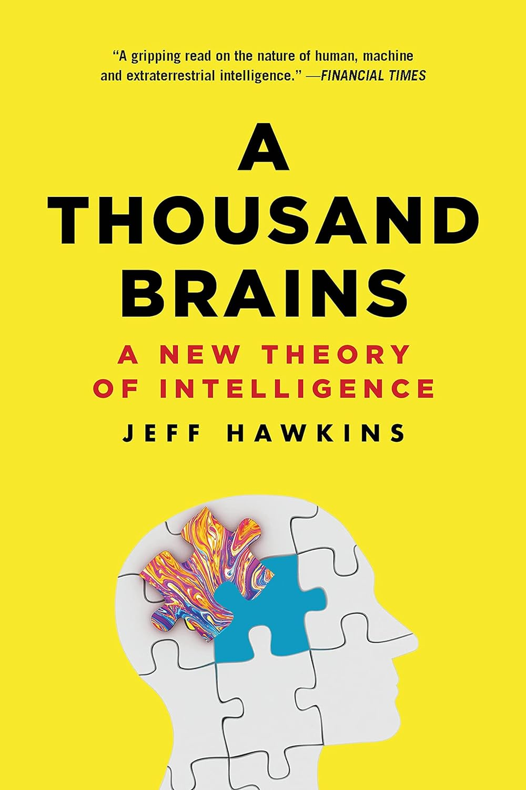
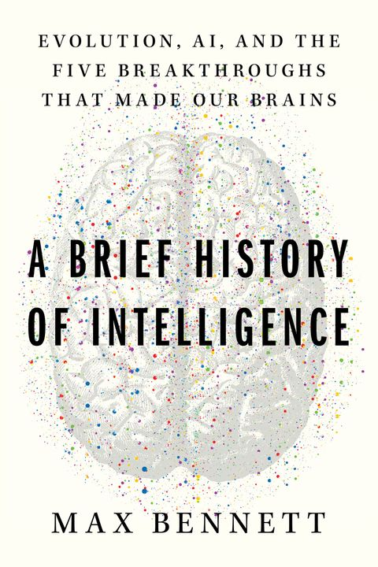
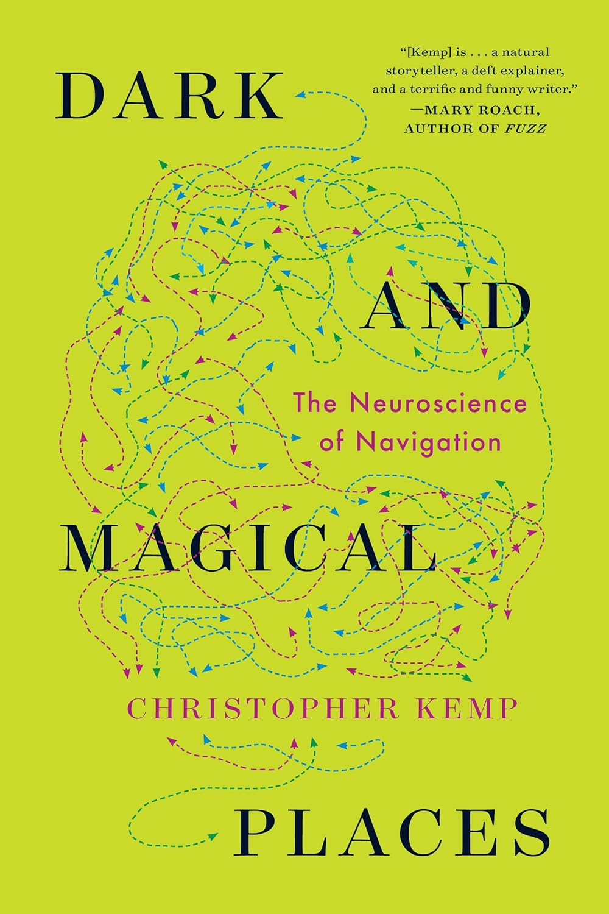
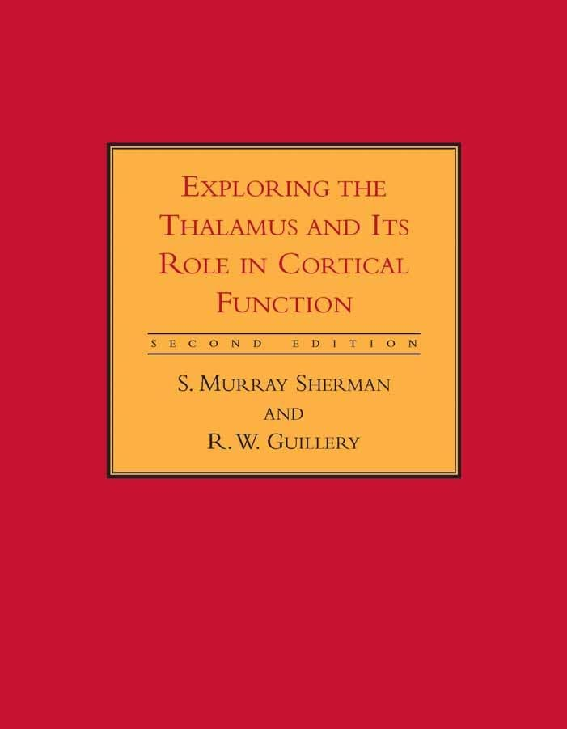
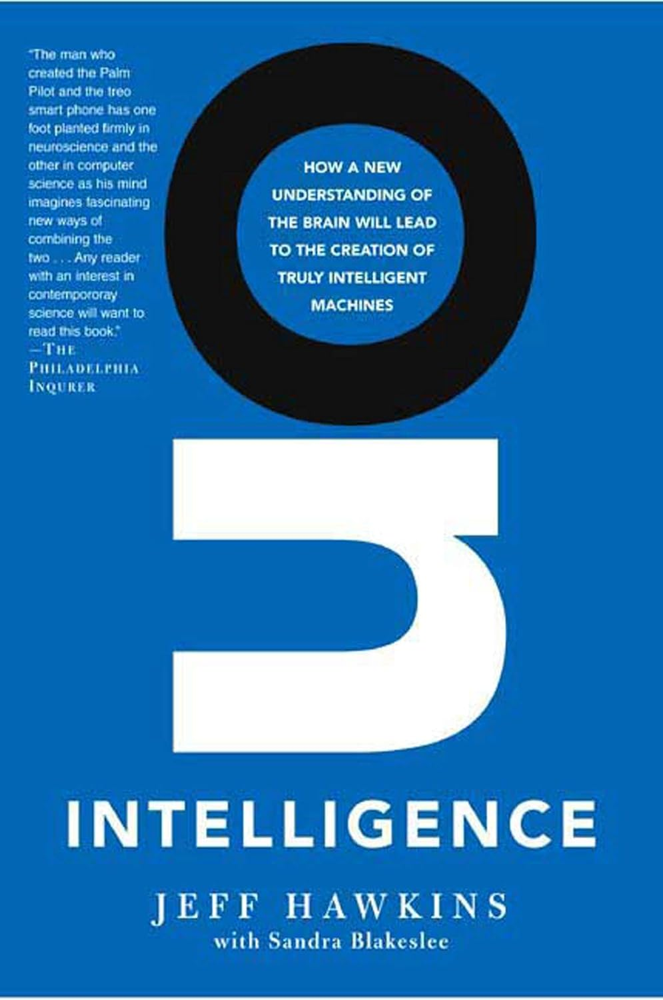
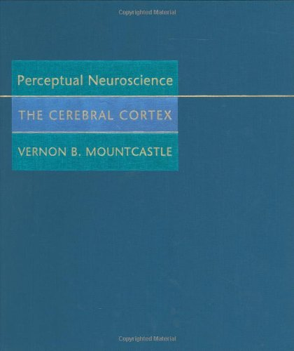
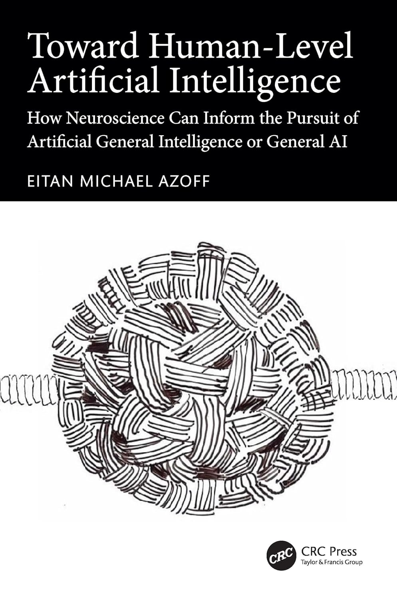

# Books

_(alphabetically)_

|  |  |
|---|---|
|  | **A Thousand Brains: A New Theory of Intelligence** by Jeff Hawkins |
| **A Brief History of Intelligence: Evolution, AI, and the Five Breakthroughs that Made our Brains** by Max Bennett |  |
|  | **Dark and Magical Places: The Neuroscience of Navigation** by Christopher Kemp |
| **Exploring the Thalamus and Its Role in Cortical Function** by S. Murray Sherman and R. W. Guillery |  |
|  | **On Intelligence: How a New Understanding of the Brain Will Lead to the Creation of Truly Intelligent Machines** by Jeff Hawkins and Sandra Blekeslee |
| **Perceptual Neuroscience: The Cerebral Cortex** by Vernon B. Mountcastle |  |
|  | **Toward Human-Level Artificial Intelligence: How Neuroscience Can Inform the Pursuit of Artificial General Intelligence or General AI** by Eitan M. Azoff |

# Papers

_(by year)_

This is an extremely stripped-down list of the hundreds of papers on which our theory and ideas are based. We tried to collect a few key review articles summarizing important findings that we regularly come back to in our research meetings.

## Neuroscience

Felleman, D. J., & Van Essen, D. C. (1991). **Distributed hierarchical processing in the primate cerebral cortex.** Cerebral Cortex, 1(1), 1–47. <https://doi.org/10.1093/cercor/1.1.1>

Mountcastle, V. (1997). **The columnar organization of the neocortex.** Brain, 120(4), 701–722. <https://doi.org/10.1093/brain/120.4.701>

Thomson, A. (2003). **Interlaminar connections in the neocortex.** Cerebral Cortex, 13(1), 5–14. <https://doi.org/10.1093/cercor/13.1.5>

Markram, H., Toledo-Rodriguez, M., Wang, Y., Gupta, A., Silberberg, G., & Wu, C. (2004). **Interneurons of the neocortical inhibitory system**. Nature Reviews Neuroscience, 5(10), 793–807. <https://doi.org/10.1038/nrn1519>

Sherman, S. M. (2005). **Thalamic relays and cortical functioning.** In Progress in Brain Research (Vol. 149, pp. 107–126). Elsevier. <https://doi.org/10.1016/S0079-6123(05)49009-3>

Hegdé, J., & Felleman, D. J. (2007). **Reappraising the functional implications of the primate visual anatomical hierarchy.** The Neuroscientist, 13(5), 416–421. <https://doi.org/10.1177/1073858407305201>

Thomson, A. M. (2007). **Functional maps of neocortical local circuitry.** Frontiers in Neuroscience, 1(1), 19–42. <https://doi.org/10.3389/neuro.01.1.1.002.2007>

Thomson, A. (2010). **Neocortical layer 6, a review**. Frontiers in Neuroanatomy, 4, Article 13. <https://doi.org/10.3389/fnana.2010.00013>

Sherman, S. M., & Guillery, R. W. (2011). **Distinct functions for direct and transthalamic corticocortical connections.** Journal of Neurophysiology, 106(3), 1068–1077. <https://doi.org/10.1152/jn.00429.2011>

Petersen, C. C. H., & Crochet, S. (2013). **Synaptic computation and sensory processing in neocortical layer 2/3.** Neuron, 78(1), 28–48. <https://doi.org/10.1016/j.neuron.2013.03.020>

Gu, Y., Lewallen, S., Kinkhabwala, A. A., Domnisoru, C., Yoon, K., Gauthier, J. L., Fiete, I. R., & Tank, D. W. (2018). **A map-like micro-organization of grid cells in the medial entorhinal cortex. **Cell, 175(3), 736–750.e30. <https://doi.org/10.1016/j.cell.2018.08.066>

## Theory

Usrey, W. M., & Sherman, S. M. (2019). **Corticofugal circuits: Communication lines from the cortex to the rest of the brain.** Journal of Comparative Neurology, 527(3), 640–650. <https://doi.org/10.1002/cne.24423>

Whittington, J. C. R., Muller, T. H., Mark, S., Chen, G., Barry, C., Burgess, N., & Behrens, T. E. J. (2020). **The Tolman-Eichenbaum machine: Unifying space and relational memory through generalization in the hippocampal formation. **Cell, 183(5), 1249–1263. <https://doi.org/10.1016/j.cell.2020.10.024>

Rao, R. P. N. (2022). **A sensory-motor theory of the neocortex based on active predictive coding.** bioRxiv. <https://doi.org/10.1101/2022.12.30.522267>

Suzuki, M., Pennartz, C. M. A., & Aru, J. (2023). **How deep is the brain? The shallow brain hypothesis.** Nature Reviews Neuroscience. <https://doi.org/10.1038/s41583-023-00756-z>

## Our Papers

Hawkins, J., & Ahmad, S. (2016). **Why neurons have thousands of synapses: A theory of sequence memory in neocortex.** Frontiers in Neural Circuits, 10, Article 23. <https://doi.org/10.3389/fncir.2016.00023>

Hawkins, J., Ahmad, S., & Cui, Y. (2017). **A theory of how columns in the neocortex enable learning the structure of the world.** Frontiers in Neural Circuits, 11, Article 81. <https://doi.org/10.3389/fncir.2017.00081>

Ahmad, S., & Scheinkman, L. (2019). **How can we be so dense? The benefits of using highly sparse representations.** arXiv. <https://arxiv.org/abs/1903.11257>

Hawkins, J., Lewis, M., Klukas, M., Purdy, S., & Ahmad, S. (2019). **A framework for intelligence and cortical function based on grid cells in the neocortex.** Frontiers in Neural Circuits, 12, Article 121. <https://doi.org/10.3389/fncir.2018.00121>

Hole, K. J., & Ahmad, S. (2021). **A thousand brains: Toward biologically constrained AI**. SN Applied Sciences, 3(8), 743. <https://doi.org/10.1007/s42452-021-04715-0>

Clay, V., Leadholm, N., & Hawkins, J. (2024). **The Thousand Brains Project: A New Paradigm for Sensorimotor Intelligence.** arXiv. <https://arxiv.org/abs/2412.18354#>

Leadholm, N., Clay, V., Knudstrup, S., Lee, H., Hawkins, J. (2025) **Thousand-Brains Systems: Sensorimotor Intelligence for Rapid, Robust Learning and Inference** arXiv. <https://arxiv.org/abs/2507.04494>

> [!NOTE]
> You can read the [Thousand-Brains Systems Plain Language Explainer](https://thousandbrains.org/thousand-brain-systems-sensorimotor-intelligence-for-rapid-robust-learning-and-inference-a-plain-language-explainer/) for a less technical overview of the concepts in the above paper.

Hawkins, J., Leadholm, N., Clay, V. (2025) **Hierarchy or Heterarchy? A Theory of Long-Range Connections for the Sensorimotor Brain** arXiv. <https://arxiv.org/abs/2507.05888>

> [!NOTE]
> You can read the [Hierarchy or Heterarchy Plain Language Explainer](https://thousandbrains.org/hierarchy-or-heterarchy-a-theory-of-long-range-connections-for-the-sensorimotor-brain-a-plain-language-explainer/) for a less technical overview of the concepts in the above paper.

# Other Resources
## Videos
As we are working on the neuroscience theory, we are publishing recordings of those meetings on [our YouTube channel](https://www.youtube.com/@thousandbrainsproject/videos). Those videos contain our most up-to-date thinking and the questions we are struggling with on a day-to-day basis. If you are curious in the neuroscience behind this project, you can have a look at your [brainstorming](https://www.youtube.com/watch?v=VTy9KIUvAj4&list=PLXpTU6oIscrkYkv1qoN5Ctod9qr7NbgKg) and [review](https://www.youtube.com/watch?v=FPLQaGPK24k&list=PLXpTU6oIscrkY-n0p2ulFeZJFBVpOSf4J) video series. For a short introduction to the project you can have a look at our [quick-start series](https://www.youtube.com/watch?v=tbqZHVlK4sE&list=PLXpTU6oIscrn5ImFcRJQ3ameHbMWNd9Df) and for a longer overview of key aspects of the project our [core video series](https://www.youtube.com/watch?v=Pody7qWszHg&list=PLXpTU6oIscrlEoV5pOaX5Swnow-xO9xwk&pp=0gcJCV8EOCosWNin).

Below is a great introductory video of Jeff Hawkins presenting an overview of our neuroscience theory.

[2025/02 - Cortical Circuit Overview](https://www.youtube.com/watch?v=owRC8sLSb64)